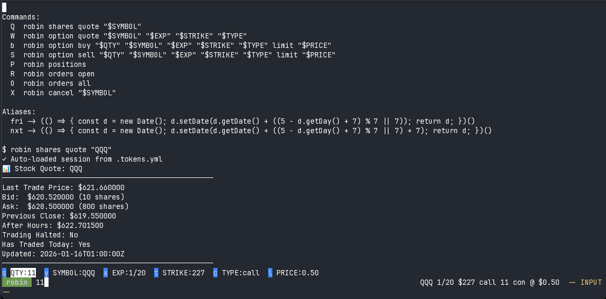

# Marionette (`mari`)

Rapid hotkey-driven shell execution.

## Screenshot



## Features

- **Hotkey-driven**: Single-key commands for instant execution
- **Activity-based**: Switch between different activity contexts (git, podman, trading, etc.)
- **Variable system**: Define and edit variables with type validation (int, float, string, enum, date)
- **VAR EDIT mode**: Real-time variable editing with MIDI jog wheel support (for fun)
- **LLM mode**: Send prompts to a configured LLM with scrollback buffer as context
- **SHELL mode**: Execute raw shell commands without leaving the REPL
- **Persistent values**: Variable values are saved to YAML and restored on restart
- **Configurable status bar**: Custom status format with variable substitution
- **Scroll region**: Clean terminal output with fixed status bar

## Installation

```bash
# Install dependencies
bun install

# Link globally
bun link
```

## Usage

```bash
# Start REPL mode
listy repl

# Start with specific activity
listy repl robin

# Shell mode (run single command)
listy <command> [args...]
```

## Keyboard Shortcuts

### NORMAL Mode
- `Tab` / `Shift+Tab` - Switch between activities
- `:` - Enter CMD mode
- `$` - Enter VAR EDIT mode
- `@` - Enter LLM mode
- `!` - Enter SHELL mode
- `?` - Show available commands
- `Ctrl+L` - Clear screen and buffer
- `Ctrl+C` / `Ctrl+D` - Exit

### VAR EDIT Mode
- Variable hotkeys (e.g., `q`, `y`, `t`) - Select and edit variable (blanks input)
- `←` / `→` - Navigate between variables
- `↑` / `↓` or `+` / `-` - Increment/decrement value
- `Enter` - Apply changes and persist to disk
- `Escape` - Discard changes and exit

### CMD Mode
- `:set VAR VALUE` - Set variable value
- `:unset VAR` - Reset variable to default
- `:vars` - List all variables
- `:help` - Show help

### LLM Mode
- Type your prompt, `Enter` to submit (stays in LLM mode)
- `Escape` - Exit to NORMAL mode
- `@agent` prefix - Specify agent (e.g., `@solo what is 2+2?` sets `$_AGENT=solo`)

The prompt is sent to the command configured in `config.yml`. The scrollback buffer (`buffer.log`) is available as context via `$_BUFFER`.

### SHELL Mode
- Type a shell command, `Enter` to execute (stays in SHELL mode)
- `Escape` - Exit to NORMAL mode

## Global Configuration

Create `config.yml` in the project root for global settings:

```yaml
# Command executed when submitting input in LLM mode (@)
# $* is replaced with the user's input string
# $_BUFFER is the path to buffer.log (scrollback capture)
# $_AGENT is the agent name, parsed from @agent prefix or default_agent
#   e.g. input "@solo what is 2+2?" sets $_AGENT=solo, $*="what is 2+2?"
default_agent: text
llm_shell: cat $_BUFFER | subd -t "$_AGENT" "$*"
```

### Buffer Logging

All stdout/stderr from executed commands is captured to `buffer.log` in the project root. This file is:
- Appended to on each command output
- Truncated when `Ctrl+L` is pressed
- Available in LLM mode via `$_BUFFER` for providing context to the LLM

## Activity Configuration

Activities are defined in YAML files in the `activity/` directory:

```yaml
name: robin
description: Stock & Options Trading
color: "#6a994e"
statusFormat: ${SYMBOL} ${EXP} $${STRIKE} ${TYPE} ${QTY} con @ $${PRICE}
variables:
  QTY:
    type: int
    default: "10"
    range:
      - 1
      - 100
    step: 1
    format: "%d"
    hotkey: q
    value: 48
  SYMBOL:
    type: string
    default: "'TSLA'"
    hotkey: "y"
    value: IWM
  EXP:
    type: date
    default: new Date()
    range: 2025-01-01..2026-12-31
    step: 1
    format: M/d
    hotkey: x
    value: "2026-01-16T07:27:56.906Z"
  STRIKE:
    type: float
    default: "225.0"
    range:
      - 1
      - 9999
    step: 0.5
    format: "%.0f"
    hotkey: t
    value: 265.5
  TYPE:
    type: enum
    default: "'call'"
    range:
      - call
      - put
    hotkey: c
    value: put
  PRICE:
    type: float
    default: "0.50"
    range:
      - 0.01
      - 999.99
    step: 0.01
    format: "%.2f"
    hotkey: l
    value: 0.2899999999999999
commands:
  Q: robin shares quote "$SYMBOL"
  W: robin option quote "$SYMBOL" "$EXP" "$STRIKE" "$TYPE"
  A: robin -y option buy "$QTY" "$SYMBOL" "$EXP" "$STRIKE" "$TYPE" limit ask+1
  b: robin -y option buy "$QTY" "$SYMBOL" "$EXP" "$STRIKE" "$TYPE" limit "$PRICE"
  S: robin -y option sell "$QTY" "$SYMBOL" "$EXP" "$STRIKE" "$TYPE" limit "$PRICE"
  Z: robin -y option sell all "$SYMBOL" "$EXP" "$STRIKE" "$TYPE" limit ask-1
  P: robin positions
  R: robin orders open
  O: robin orders all
  X: robin cancel "$SYMBOL"
aliases:
  fri: (() => { const d = new Date(); d.setDate(d.getDate() + ((5 - d.getDay() + 7) % 7 || 7)); return d; })()
```

### Variable Types

- `string` - Text value
- `int` - Integer with optional range and step
- `float` - Floating point with optional range and step
- `enum` - One of a fixed set of values
- `date` - Date value with range and step (days)